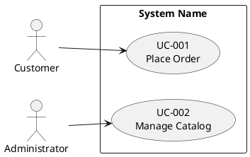
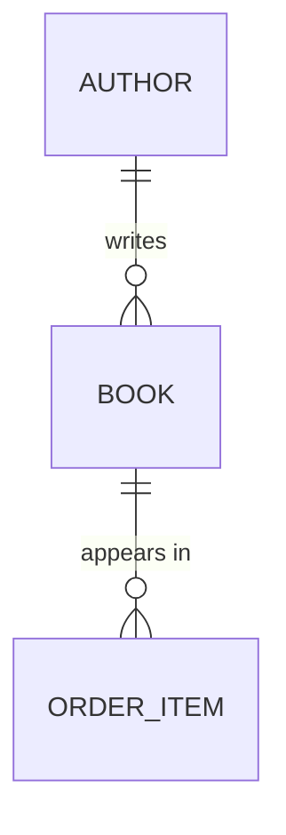

# Reverse Engineer Project to AIUP Artifacts

## Goal

Produce three artifacts from an existing codebase, matching exactly the
formats used by the forward-engineering skills (`/use-case-diagram`,
`/use-case-spec`, `/entity-model`) so the output is a drop-in starting point
for the rest of the AI Unified Process workflow:

1. `docs/use_cases.puml` — PlantUML use case diagram (actors and use cases)
2. `docs/use_cases/UC-XXX-name.md` — one specification document per use case
3. `docs/entity_model.md` — entity model with Mermaid ER diagram and attribute tables

The forward-engineering skills derive these from a vision/requirements
document; you derive them from code, configuration, schema, and tests.

## How to think about this task

You are not transcribing the code. You are recovering the *intent* the code
was built to satisfy and writing it down at the level a business analyst would
have written it before implementation. Two implications:

- **Stay above the implementation.** Use case steps describe what an actor
  and the system do, not which framework method is called. "User submits the
  form" — not "the controller dispatches POST /reservations".
- **Aggregate, don't enumerate.** A REST controller with a dozen endpoints is
  rarely a dozen use cases. Several endpoints often serve one user goal
  (e.g. `GET /form` + `POST /submit` + `GET /confirm` is *one* use case).
  Group related operations by the goal an actor pursues end-to-end.

If a user goal is partially implemented or unclear, write the use case for
what the code clearly does and add a short note under it. Don't invent flows
the code doesn't support.

## Workflow

Use TodoWrite to track progress through these stages.

### 1. Project discovery

Establish what kind of project you are looking at before extracting anything.
Skim — don't deep-read yet.

- Detect the stack (build files: `pom.xml`, `build.gradle`, `package.json`,
  `requirements.txt`, `Gemfile`, `go.mod`, `*.csproj`, etc.). Note the
  framework (Spring, Django, Rails, Express, Next.js, .NET, etc.) and the
  ORM/data layer (JPA, jOOQ, Prisma, SQLAlchemy, ActiveRecord, EF Core,
  raw SQL migrations).
- Locate the entry points to user-facing behavior: HTTP controllers, GraphQL
  resolvers, view classes, route handlers, CLI commands, scheduled jobs.
- Locate the data layer: entity classes, ORM models, schema migrations
  (Flyway, Liquibase, Alembic, Prisma migrations), DDL files.
- Locate authentication/authorization configuration: this is your richest
  source of *actors*.
- Note the test directory: tests often state the intended behavior more
  clearly than the implementation does.

For concrete patterns by stack, see [references/stack-signals.md](references/stack-signals.md).

### 2. Identify actors

Actors are roles, not individual users. Sources:

- Role/authority definitions: Spring Security `hasRole(...)`, `@RolesAllowed`,
  Django groups/permissions, Rails CanCan abilities, custom RBAC tables.
- Authentication boundaries: anonymous-allowed routes imply an unauthenticated
  actor (often "Visitor" or "Guest"); authenticated routes imply at least one
  authenticated actor.
- External system integrations (webhooks, scheduled jobs that call external
  APIs, message consumers) are actors too — name them after the system or its
  role ("Payment Provider", "Scheduler").

If the codebase has only one role, you still typically have at least two
actors: an unauthenticated visitor and the authenticated user.

### 3. Extract use cases

A use case is a complete interaction in which an actor achieves a goal. Walk
the entry points and group them by goal:

- Start from each entry point (controller method, route handler, view action).
- Ask: "what is the actor *trying to accomplish* by triggering this?" That
  goal — not the endpoint — is the use case.
- Endpoints that serve the same goal collapse into one use case. A wizard,
  a multi-step form, or a list+detail+edit triple is usually one use case.
- Pure infrastructure endpoints (`/health`, `/metrics`, static asset routes,
  framework-internal callbacks) are not use cases. Skip them.

**Worked example — collapse CRUD endpoints into goals, not one-per-route:**

| Endpoints found                                                            | Use cases (NOT one per endpoint)              |
|----------------------------------------------------------------------------|-----------------------------------------------|
| `GET /books`, `GET /books/{id}`, `POST /books`, `PUT /books/{id}`, `DELETE /books/{id}` | **UC-001 Manage Catalog** (one use case) |
| `GET /cart`, `POST /cart/items`, `DELETE /cart/items/{id}`, `POST /checkout` | **UC-002 Place Order** (one use case)        |
| `POST /login`, `POST /logout`, `GET /me`                                   | **UC-003 Authenticate** (one use case)        |

Eight endpoints above → three use cases, not eight specs.

**Self-check (do this before writing any spec):** count your endpoints and
count your use cases. If the two numbers are close, you have *not* aggregated —
you are mirroring the API surface. Re-group every endpoint under the actor goal
it serves and merge until each use case is a complete goal an actor pursues
end-to-end.

A small codebase is *not* an excuse to skip aggregation. Even a compact API with
10–15 route handlers usually collapses to roughly 4–8 use cases — a CRUD resource
(`list` + `get` + `create` + `update` + `delete`) is **one** "Manage X" use case,
not five. If you are about to write more than 8 spec files for a small service,
stop and merge: you are almost certainly enumerating endpoints, not goals.

Assign each use case an ID `UC-001`, `UC-002`, … in a stable order (group
by actor, then by importance to the system's purpose). Pick a short
descriptive name in title case.

### 4. Generate the use case diagram

Write `docs/use_cases.puml`. Follow the format from the `/use-case-diagram`
skill exactly:



- Use the actual system name from `pom.xml` / `package.json` / project README.
- Each `usecase` block contains the ID and the use case name on two lines.
- Connect every actor to at least one use case; every use case to at least
  one actor.
- Add `<<include>>` or `<<extend>>` only when the code shows a clear shared
  sub-flow (e.g. a `loginRequired` filter that's reused across many use cases
  is rarely worth modeling — it's a precondition, not an include).

### 5. Write use case specifications

Create `docs/use_cases/` and write one file per use case named
`UC-XXX-short-name.md` (kebab-case). Use the structure from
`/use-case-spec`:

- **Overview**: ID, name, primary actor, goal, status (`Implemented` is
  usually the right status when reverse-engineering working code; use
  `Draft` only if the implementation is partial or you're unsure).
- **Preconditions**: derive from auth checks, route guards, validation
  guards that fail fast, and required upstream state (e.g. "guest is
  registered" if the route requires a session).
- **Main Success Scenario**: numbered steps written from the actor and
  system perspective — never naming framework methods, SQL, or HTTP verbs.
  Trace the happy path through the code and abstract each branch into a
  single business-level step.
- **Alternative Flows**: derive from `if/else` on validation, exception
  handlers, conditional UI flows, and tested error cases. Number them
  `A1`, `A2`, … and give each a clear trigger that names the step it
  diverges from.
- **Postconditions**: success postconditions come from successful database
  writes, emitted events, sent emails, and returned redirects. Failure
  postconditions come from rollbacks and error responses.
- **Business Rules**: extract from validation annotations, domain
  constants, configuration, and any `if (...)` that encodes a policy
  decision (limits, thresholds, eligibility). Name them `BR-001`, `BR-002`,
  …; renumber globally across use cases so each rule has a unique ID.

The full template lives at the `/use-case-spec` skill —
[skills/use-case-spec/references/use-case.md](../use-case-spec/references/use-case.md)
inside this plugin.

#### Step writing — what to keep at the business level

| Code reality                                  | Use case step                              |
|-----------------------------------------------|--------------------------------------------|
| `POST /reservations` returns `201`            | "System creates the reservation"           |
| `if (!cart.isEmpty()) { … }`                  | A1 trigger: "Cart is empty"                |
| `@NotNull` annotation on `email`              | BR: "Email is required"                    |
| `if (amount > 10_000) requireApproval()`      | BR: "Orders over 10,000 require approval"  |
| `mailService.send(confirmation)`              | "System sends a confirmation email"        |
| `throw new InsufficientStockException()`      | A2 trigger: "Requested quantity exceeds stock" |

If a step would only make sense to someone who has read the code, rewrite it.

### 6. Extract the entity model

> **Treat this as a dedicated pass, not an afterthought.** The entity model is
> the artifact most often degraded when it is rushed at the end of a long
> reverse-engineering task. Give it the same care as a standalone `/entity-model`
> run: **every** entity gets a 5-column table (`Attribute | Description | Data
> Type | Length/Precision | Validation Rules`), **every** type is mapped to the
> AIUP vocabulary, and **no** raw SQL/ORM type (`VARCHAR`, `bigint`, `numeric`,
> `int8`, `TEXT`, `Decimal(10,2)`, `@db.Decimal`, Prisma `Int`/`String?`) survives
> into the document. If you would not ship this table from `/entity-model`, it is
> not done.

Write `docs/entity_model.md` matching the `/entity-model` format. Sources,
in order of authority:

1. **Schema migrations** (Flyway `V*.sql`, Liquibase changelogs, Alembic,
   Prisma migrations). These are the truth — the database is what runs.
2. **ORM models** (JPA entities, Django models, ActiveRecord, Prisma
   schema). Use these to recover names, relationships, and validation that
   migrations don't capture.
3. **DTOs and form classes** — only as a last resort when the data model is
   inferred rather than declared.

For each entity, write:

- A `### ENTITY_NAME` heading (UPPER_SNAKE_CASE).
- A one-sentence description of what the entity represents (not what it
  contains — that's the table).
- An attribute table with **exactly these 5 columns, in this order**:
  `Attribute | Description | Data Type | Length/Precision | Validation Rules`.

Match this exact shape — a Mermaid block with relationships only, followed by
one `###` section per entity with a filled 5-column table:

```markdown
# Entity Model

## Entity Relationship Diagram



### BOOK

A title available for sale in the catalog.

| Attribute | Description           | Data Type | Length/Precision | Validation Rules                  |
|-----------|-----------------------|-----------|------------------|-----------------------------------|
| id        | Unique identifier     | Long      | 19               | Primary Key, Sequence             |
| title     | Title of the book     | String    | 200              | Not Null                          |
| isbn      | ISBN-13 code          | String    | 13               | Not Null, Unique                  |
| price     | Sale price in CHF     | Decimal   | 10,2             | Not Null, Min: 0                  |
| author_id | Author of the book    | Long      | 19               | Not Null, Foreign Key (AUTHOR.id) |
```

Never leave the Validation Rules column empty and never emit raw SQL types
(`VARCHAR(200)`, `bigint`, `numeric`) — map them to the AIUP vocabulary below.

Map types to the AIUP type vocabulary (`Long`, `String`, `Integer`,
`Decimal`, `Boolean`, `Date`, `DateTime`) — don't leak `VARCHAR(255)` or
`bigint` into the document. Map validation to the AIUP vocabulary too
(`Primary Key, Sequence`, `Not Null`, `Not Null, Unique`, `Not Null,
Foreign Key (TABLE.id)`, `Optional`, `Not Null, Min: X, Max: Y`,
`Not Null, Values: A, B, C`, `Not Null, Format: Email`).

The Mermaid ER diagram contains relationships **only** — no attributes
inside entity blocks. Derive cardinality from foreign key constraints and
ORM associations:

| ORM/SQL signal                                    | Mermaid relationship              |
|---------------------------------------------------|-----------------------------------|
| Foreign key `NOT NULL`, `@ManyToOne(optional=false)` | `A ||--o{ B`                   |
| Foreign key nullable, `@ManyToOne(optional=true)` | `A |o--o{ B`                      |
| `@OneToOne`, unique foreign key                   | `A ||--|| B`                      |
| `@ManyToMany` / join table                        | `A }o--o{ B` (via join entity)    |

Skip pure technical tables (Flyway's `flyway_schema_history`, Spring
session tables, audit/log tables that aren't part of the domain). If
unsure whether a table is domain-relevant, include it — it's easier for
the user to delete than to miss.

### 7. Cross-validate

Before finishing, check the three documents agree:

- Every actor in the diagram is the primary actor on at least one spec.
- Every use case ID in the diagram has a matching spec file.
- Every entity referenced as a noun in a use case spec exists in the
  entity model.
- Every business rule is numbered uniquely across all specs (`BR-001`,
  `BR-002`, …).
- The mermaid diagram has a section for every entity it names, and every
  entity section appears in the diagram.
- **Aggregation check:** your use-case count is meaningfully smaller than your
  endpoint count. If it is not, you mirrored the API — go back and merge.
- **Entity-model format check:** every attribute table has exactly 5 columns
  in the required order; no raw SQL types (`VARCHAR`, `bigint`, `numeric`,
  `int8`) appear anywhere; no Validation Rules cell is empty; no attributes
  appear inside the Mermaid entity blocks.

### 8. Summarize for the user

End with a short summary: how many use cases, how many entities, which
endpoints/files you couldn't classify (be honest about gaps), and a
recommendation for what the user should review first — typically the
use cases where the main success scenario was hard to recover, since
those are the ones most likely to need a human pass.

## DO NOT

- Invent use cases, business rules, or entities that aren't supported by the
  code. If you're guessing, say so in the summary instead of writing it down
  as fact.
- Copy class, method, or table names verbatim into use case names. Use case
  names are in the language of the user, not the developer.
- Generate one use case per HTTP endpoint reflexively. Group by goal.
- Put attributes inside the Mermaid entity blocks (the `/entity-model` skill
  forbids this — keep the ER diagram showing relationships only).
- Skip writing the entity model because "the migrations already exist". The
  whole point is to translate the schema into the AIUP vocabulary.
- Write multi-paragraph descriptions of "what the system does" outside the
  three artifact files. The artifacts *are* the documentation.

## When the project is large

If the codebase has many entry points (say, more than ~30), do not try to
hold the whole project in your head. Instead:

1. Make one pass over the directory tree to list every controller/route file.
2. Cluster them by feature (often visible from package or directory names).
3. Process one cluster at a time end-to-end (actors → use cases → specs),
   appending to the diagram as you go.
4. Process the data layer once at the end, since entities are typically
   shared across features.

This keeps each pass small enough to do well rather than producing 30
shallow specs.
